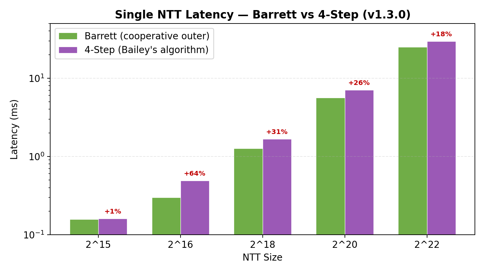
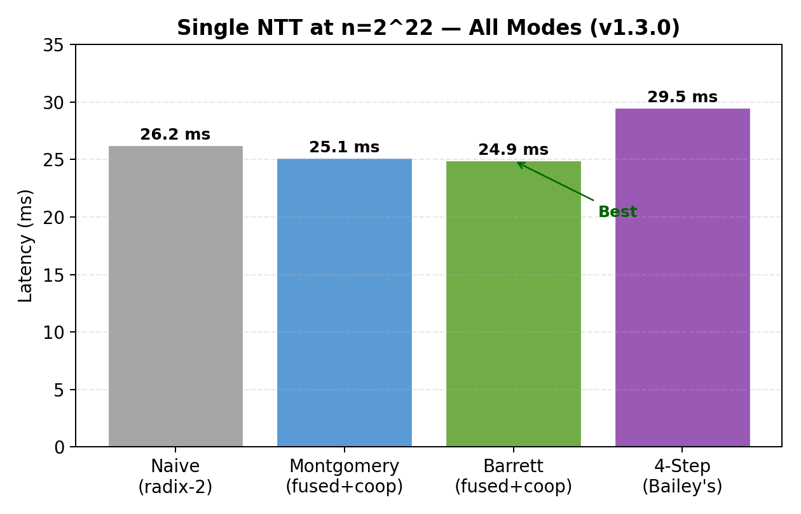
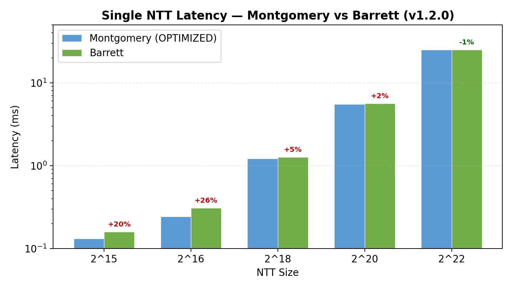
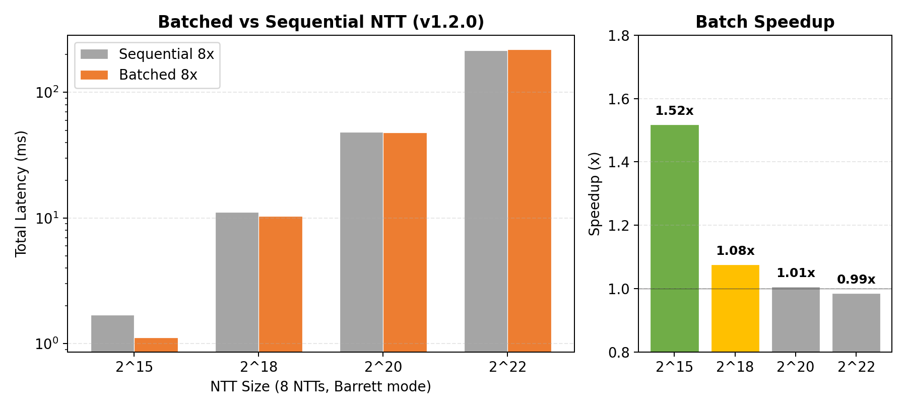
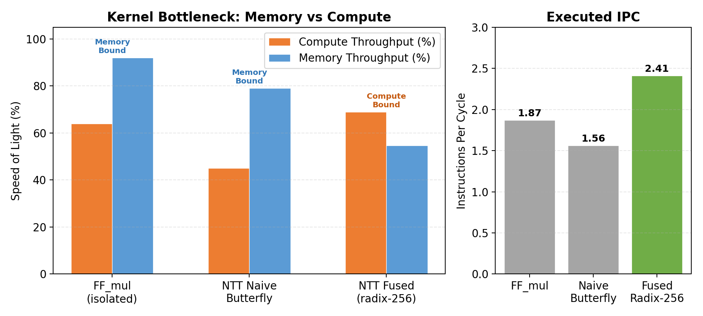
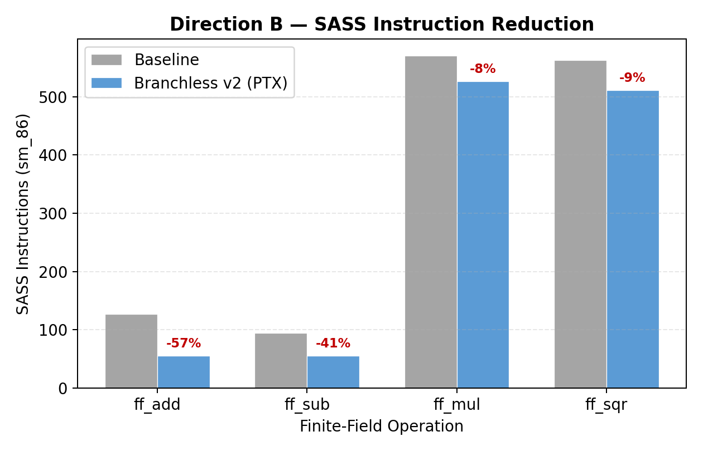

# cuda-zkp-ntt

**GPU-Accelerated Number-Theoretic Transform for Zero-Knowledge Proofs**

[](https://github.com/Artemarius/cuda-zkp-ntt/actions/workflows/build.yml)
[](https://developer.nvidia.com/cuda-toolkit)
[](https://en.cppreference.com/w/cpp/17)
[](LICENSE)

---

## Highlights

- **v1.4.0: 17.1 ms at n=2^22** — 32% faster than v1.1.0 via branchless arithmetic + radix-4 outer stages
- **CUDA Graph API**: captures NTT kernel sequence for graph replay in larger workflows
- **Radix-4 outer stages**: fuses pairs of butterfly stages for ~45% DRAM traffic reduction
- **Barrett + Montgomery dual arithmetic**: Barrett NTT eliminates 12% Montgomery conversion overhead
- **Batched NTT**: process 8 independent NTTs in 3-4 kernel launches (vs 32 sequential); **1.52x throughput** at 2^15
- **1.66x pipeline speedup** at 2^18 via 3-stream async double-buffered NTT (Direction A)
- **4 kernel launches** for n=2^22 (was 16): warp-shuffle fused radix-1024 + cooperative groups outer fusion
- **Memory-bound to compute-bound transformation**: fused kernel shifts bottleneck from 92% DRAM to 69% compute, IPC 1.56 to 2.41
- **57% SASS instruction reduction** in `ff_add` via branchless PTX with `lop3.b32` MUX (Direction B)
- **230 tests**, 8 Nsight Compute profiles, 10 annotated screenshots — full ZKProphet-style analysis on RTX 3060
- BLS12-381 scalar field, 255-bit Montgomery + Barrett arithmetic, production-grade modulus

---

## Motivation

Recent performance studies ([ZKProphet, IEEE IISWC 2025](https://arxiv.org/abs/2509.22684)) reveal a striking bottleneck in GPU-accelerated Zero-Knowledge Proof generation: while Multi-Scalar Multiplication (MSM) has been optimized to ~800× over CPU, the **Number-Theoretic Transform (NTT)** lags at only ~50× — and now accounts for up to **91% of end-to-end proof generation time**.

The root causes are well-documented but unaddressed in current open-source ZKP libraries:

- NTT kernels fail to overlap CPU→GPU data transfers with compute (unlike optimized MSM)
- Finite-field multiplication relies on expensive `IMAD` SASS instructions where cheaper `IADD3` sequences exist
- Launch configurations are hardcoded and frequently catastrophic (e.g., 16M blocks × 2 threads)

This project attacks both problems directly with two complementary CUDA implementations targeting the **BLS12-381 scalar field** used in production ZKP systems (Filecoin, Zcash, Ethereum rollups).

---

## What's Inside

### Direction A — Async-Pipelined NTT
A 3-stream double-buffered NTT pipeline using CUDA streams, `cudaMemcpyAsync`, and `cudaStreamWaitEvent` for cross-stream dependencies. Dedicated streams for H2D transfers, NTT compute, and D2H transfers enable maximum overlap across the GPU's copy and compute engines.

```
H2D Stream:    |--H2D(0)--|--H2D(1)--|--H2D(2)--|--H2D(3)--|
Compute[0/1]:       |--NTT(0)--|--NTT(1)--|--NTT(2)--|--NTT(3)--|
D2H Stream:              |--D2H(0)--|--D2H(1)--|--D2H(2)--|--D2H(3)--|
```

### Direction B — Optimized Finite-Field Arithmetic
A from-scratch Montgomery multiplication kernel for the BLS12-381 scalar field (255-bit prime), targeting the `IADD3` instruction path. ZKProphet §IV-C shows that 70.8% of FF_mul instruction mix is `IMAD` (4-cycle issue latency) vs `IADD3` (2-cycle). Converting the critical path reduces stall cycles and increases integer pipeline utilization.

Key implementation choices:
- 8-limb 32-bit Montgomery representation for the 255-bit BLS12-381 scalar modulus
- Fused multiply-add using PTX `mad.lo.cc` / `mad.hi.cc` intrinsics
- Conditional reduction branchless via predicated instructions
- Roofline-validated against NVIDIA A-series integer throughput ceiling

---

## Performance Results

> Profiling conducted on NVIDIA RTX 3060 Laptop GPU (Ampere, 30 SMs, CUDA 12.8).
> Reference baseline: bellperson NTT (radix-256 Cooley-Tukey).

**NTT Compute (device-to-device, no transfer):**

| Implementation | Scale 2¹⁸ | Scale 2²⁰ | Scale 2²² | vs. Naive |
|---|---|---|---|---|
| Naive GPU NTT (radix-2) | 1.36 ms | 5.93 ms | 26.3 ms | 1.0x |
| v1.1 Montgomery (fused K=10 + coop outer) | 1.21 ms | 5.51 ms | 25.1 ms | 1.04x |
| v1.2 Barrett (no Montgomery conversion) | 1.27 ms | 5.61 ms | 24.9 ms | 1.05x |
| v1.3 4-Step (Bailey's algorithm) | 1.66 ms | 7.03 ms | 29.5 ms | 0.89x |
| **v1.4 Montgomery** (branchless + radix-4) | 0.952 ms | 4.11 ms | **17.1 ms** | **1.54x** |
| **v1.4 Barrett** (branchless + radix-4) | 1.02 ms | 4.39 ms | **17.4 ms** | **1.51x** |

**Async Pipeline (end-to-end including H2D + compute + D2H, 8 batches, pinned memory):**

| | Scale 2¹⁸ | Scale 2²⁰ | Scale 2²² |
|---|---|---|---|
| Pipelined (3-stream) | 29.7 ms | 141 ms | 541 ms |
| Sequential (1-stream) | 49.4 ms | 188 ms | 579 ms |
| **Speedup** | **1.66x** | **1.33x** | **1.07x** |

*RTX 3060 Laptop GPU, Release build, 7-rep median.*
*Pipeline speedup limited at 2²² by DMA interference (memory controller contention).*

**Batched NTT Throughput (8 NTTs, compute only):**

| | Scale 2¹⁵ | Scale 2¹⁸ | Scale 2²⁰ | Scale 2²² |
|---|---|---|---|---|
| v1.4 Montgomery batch 8x | 0.874 ms | 7.51 ms | 33.4 ms | 150 ms |
| v1.4 Barrett batch 8x | 0.935 ms | 8.02 ms | 35.5 ms | 159 ms |
| v1.2 Barrett batch 8x | 1.12 ms | 10.4 ms | 48.0 ms | 219 ms |
| v1.4 vs v1.2 (Barrett) | **-17%** | **-23%** | **-26%** | **-27%** |

*Radix-4 outer stages reduce batch time by 20-27%. Montgomery remains faster than Barrett for batched workloads (fewer instructions per ff_mul).*

**4-Step NTT — Negative Result (v1.3.0):**

The 4-step NTT (Bailey's algorithm) was fully implemented and tested (221 tests) but is **slower
than the cooperative approach** at all sizes. At n=2^22: 29.5 ms (4-step) vs 24.9 ms (Barrett) =
+18%. Root cause: 3 transpose passes add DRAM overhead; sub-NTTs of 2048 elements still have 1
cooperative outer stage hitting DRAM. See [analysis](results/analysis.md#section-6--v130-results-4-step-ntt-algorithm).

<p align="center">
  
  
</p>

<p align="center">
  
  
</p>

**Nsight Compute Kernel Profile (2^20 elements):**

| Metric | FF_mul (isolated) | NTT Naive Butterfly | NTT Fused (radix-256) |
|---|---|---|---|
| Bottleneck | **Memory (92% DRAM)** | **Memory (79%)** | **Compute (69%)** |
| Compute Throughput | 64% | 45% | **69%** |
| ALU Pipe Utilization | 44.5% | 41.5% | **67.3%** |
| Executed IPC | 1.87 | 1.56 | **2.41** |
| Top Warp Stall | Long Scoreboard (mem) | LG Throttle (mem) | **Math Pipe Throttle** |
| DRAM Throughput | 305 GB/s | 260 GB/s | ~50 GB/s (shared mem) |

The fused radix-256 kernel transforms the workload from memory-bound to **compute-bound** — data lives in shared memory across 8 butterfly stages, eliminating global memory round-trips and saturating the integer ALU pipe.

**Direction B — SASS Instruction Reduction (cuobjdump, sm_86 Release):**

| FF Operation | Baseline SASS | Branchless v2 | Reduction | Technique |
|---|---|---|---|---|
| `ff_add` | 127 | 55 | **-57%** | PTX carry chain + LOP3 MUX, enables 128-bit vectorized loads |
| `ff_sub` | 94 | 55 | **-41%** | `sub.cc` chain + `lop3.b32` replaces ISETP+SEL comparison |
| `ff_mul` | 571 | 527 | **-8%** | Branchless conditional reduction (CIOS loop unchanged) |
| `ff_sqr` | 563 | 511 | **-9%** | Same as ff_mul (sqr = mul(a, a)) |

*Throughput unchanged in isolated microbenchmarks (memory-bound at 92% DRAM). Instruction-level gains realized inside the compute-bound fused NTT kernel.*

<p align="center">
  
  
</p>

See [`results/analysis.md`](results/analysis.md) for the full annotated analysis with Nsight Compute screenshots.

---

## Repository Structure

```
cuda-zkp-ntt/
├── include/
│   ├── cuda_utils.cuh         # CUDA_CHECK macro, GPU timer
│   ├── ff_arithmetic.cuh      # Finite-field types and Montgomery mul
│   ├── ff_barrett.cuh         # Barrett modular arithmetic (standard-form)
│   ├── ntt.cuh                # NTT interface (single + batched + graph, 5 modes)
│   └── pipeline.cuh           # Async pipeline infrastructure
├── src/
│   ├── ff_mul.cu              # Montgomery multiplication kernels
│   ├── ntt_naive.cu           # Baseline radix-2 NTT (correctness reference)
│   ├── ntt_optimized.cu       # NTT host dispatch: K selection + cooperative outer fusion
│   ├── ntt_fused_kernels.cu   # Fused warp-shuffle + shmem kernel (K=8/9/10, no-RDC)
│   ├── ntt_4step.cu           # 4-Step NTT: transpose, twiddle multiply, Bailey's algorithm
│   ├── ntt_async.cu           # Double-buffered async pipeline
│   └── benchmark.cu           # Profiling binary (Nsight Compute target)
├── tests/
│   ├── test_correctness.cu    # Validation against CPU reference
│   └── ff_reference.h         # CPU-only finite field + NTT reference oracle
├── benchmarks/
│   ├── bench_ntt.cu           # Google Benchmark: NTT latency vs scale
│   └── ff_microbench.cu       # Isolated FF_add / FF_mul throughput
├── profiling/
│   ├── scripts/               # Nsight Compute / Systems automation scripts
│   └── README.md              # Profiling methodology
├── results/
│   ├── screenshots/           # Nsight Compute roofline + warp analysis
│   ├── charts/                # Generated benchmark comparison charts
│   ├── data/                  # Raw benchmark CSV output
│   └── analysis.md            # Annotated performance analysis
├── scripts/
│   └── plot_benchmarks.py     # Generate charts from benchmark data
├── .github/
│   └── workflows/
│       └── build.yml            # CI: Linux (CUDA 12.8/12.6) + Windows (MSVC)
├── CMakeLists.txt
├── CLAUDE.md                  # Dev environment, conventions, file map
├── GUIDE.md                   # Deep-dive: ZKP, NTT, finite fields, GPU optimization
├── LICENSE                    # MIT License
└── README.md
```

---

## Building

### Prerequisites
- CUDA Toolkit 12.x
- CMake 3.20+
- C++17-capable compiler (GCC 11+ / MSVC 2022 / Clang 14+)
- Python 3.8+ (for profiling scripts, optional)

```bash
git clone https://github.com/Artemarius/cuda-zkp-ntt
cd cuda-zkp-ntt
```

### Linux / WSL2
```bash
cmake -B build -DCMAKE_BUILD_TYPE=Release
cmake --build build -j$(nproc)
```

### Windows (MSVC 2022)
```bash
cmake -B build -DCMAKE_CUDA_ARCHITECTURES=86
cmake --build build --config Release
```

### Running Tests
```bash
# Linux / WSL2
./build/test_correctness

# Windows (MSVC multi-config)
./build/Release/test_correctness.exe
```

### Running Benchmarks
```bash
# Linux / WSL2
./build/ff_microbench --benchmark_format=csv
./build/bench_ntt --benchmark_format=csv > results/data/bench_output.csv

# Windows (MSVC multi-config)
./build/Release/ff_microbench.exe --benchmark_format=csv
./build/Release/bench_ntt.exe --benchmark_format=csv > results/data/bench_output.csv
```

---

## Profiling

See [`profiling/README.md`](profiling/README.md) for the full Nsight Compute methodology, including roofline analysis, warp stall breakdown, and instruction-level metrics replicating the ZKProphet analysis framework on RTX 3060.

```bash
# Full Nsight Compute profile
bash profiling/scripts/profile_ntt.sh

# Lightweight metric collection
bash profiling/scripts/collect_metrics.sh
```

---

## Technical Background

See [`GUIDE.md`](GUIDE.md) for comprehensive coverage of:
- Zero-Knowledge Proof system architecture (Groth16)
- Number-Theoretic Transform: math, Cooley-Tukey algorithm, GPU parallelization
- Finite fields: Montgomery arithmetic, modular reduction, BLS12-381
- GPU microarchitecture: IMAD vs IADD3, warp stalls, occupancy, roofline model
- CUDA async compute: streams, double buffering, `cudaMemcpyAsync`

---

## Context & Related Work

This project is directly motivated by three papers:

- **ZKProphet** (Verma et al., IEEE IISWC 2025) — systematic GPU performance characterization of ZKP proof generation, identifying NTT as the dominant bottleneck post-MSM optimization
- **cuZK** (Lu et al., TCHES 2023) — efficient GPU implementation of zkSNARK with novel parallel MSM via sparse matrix operations and async data transfer
- **MoMA** (Zhang & Franchetti, [ACM CGO 2025](https://arxiv.org/abs/2501.07535)) — Multi-word Modular Arithmetic code generation achieving 13× over ICICLE for 256-bit NTTs and near-ASIC performance on commodity GPUs via Barrett reduction and batched NTT processing

The optimization targets (async NTT pipeline, IADD3-path FF_mul) are explicitly called out as open problems in ZKProphet §V-B. v1.2.0 adopts MoMA-inspired Barrett arithmetic and batched NTT processing. v1.3.0 implements the 4-step NTT (Bailey's algorithm) — a negative result that demonstrates transpose overhead exceeds outer-stage savings on consumer GPUs. v1.4.0 achieves a 32% speedup over v1.1.0 via branchless arithmetic and radix-4 outer stages, plus a CUDA Graph API for integration into larger GPU workflows. See [NTT_OPTIMIZATION_ROADMAP.md](NTT_OPTIMIZATION_ROADMAP.md) for the full optimization roadmap.

---

## License

MIT
