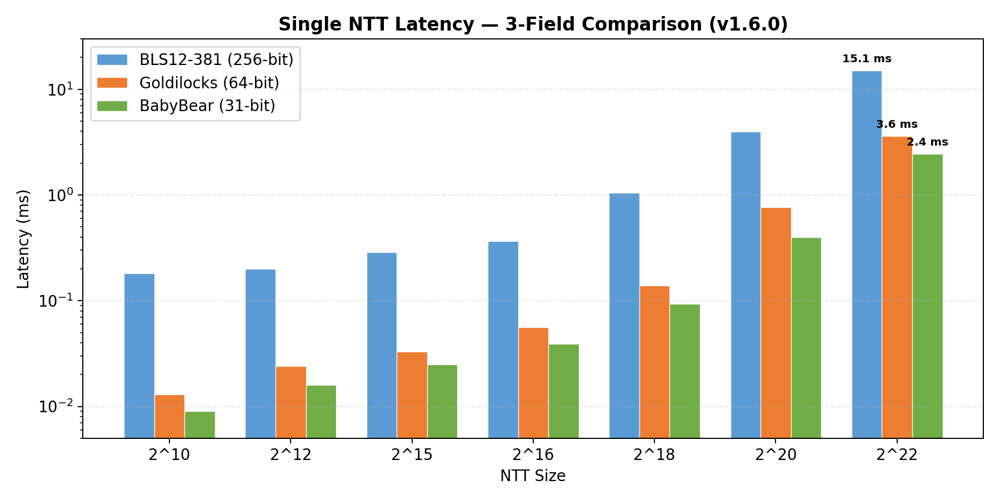
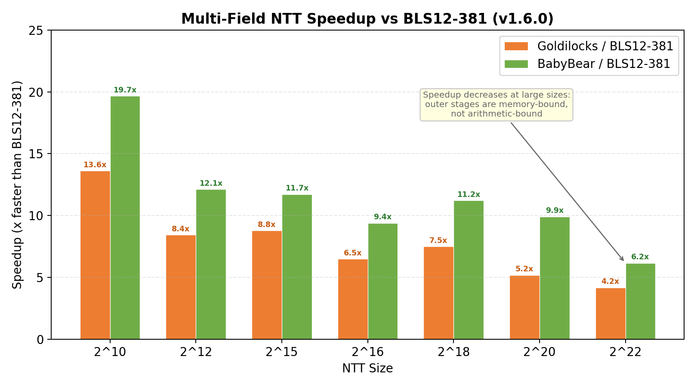
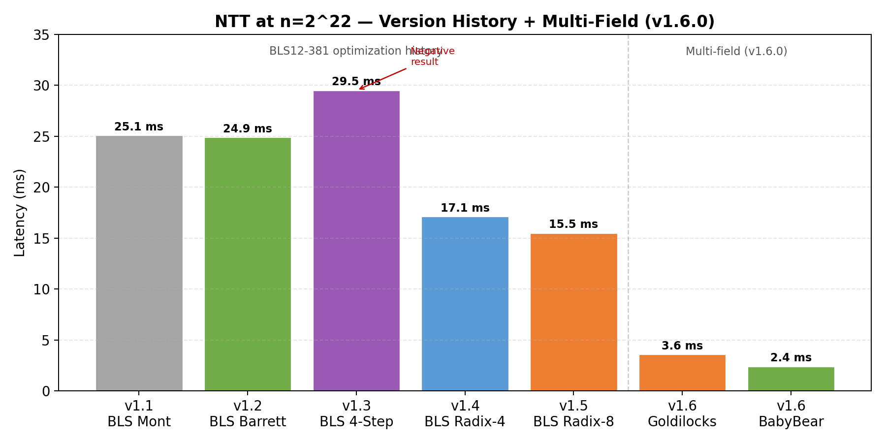
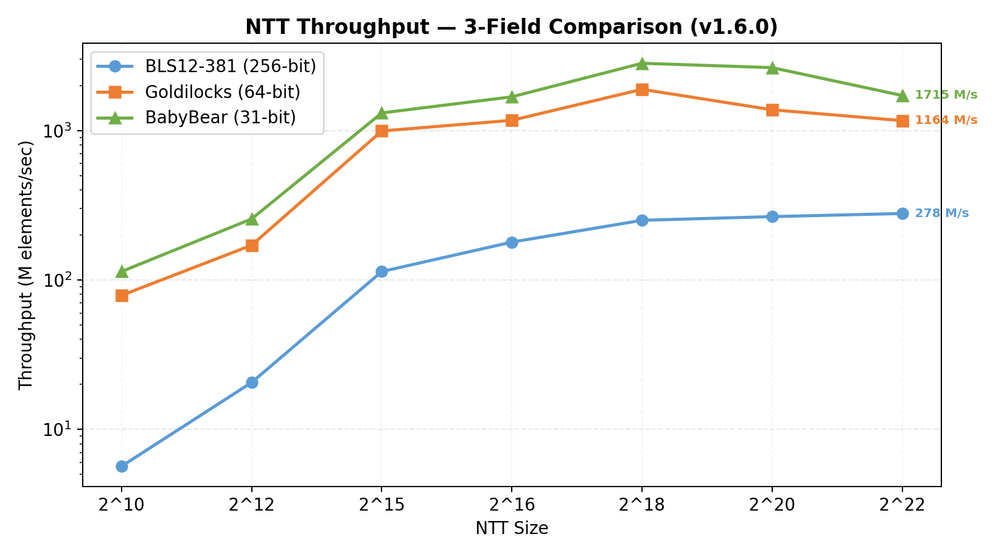
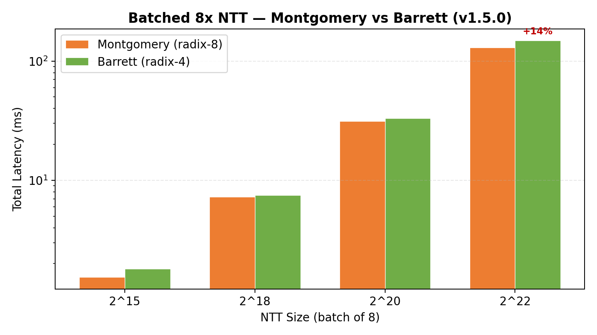
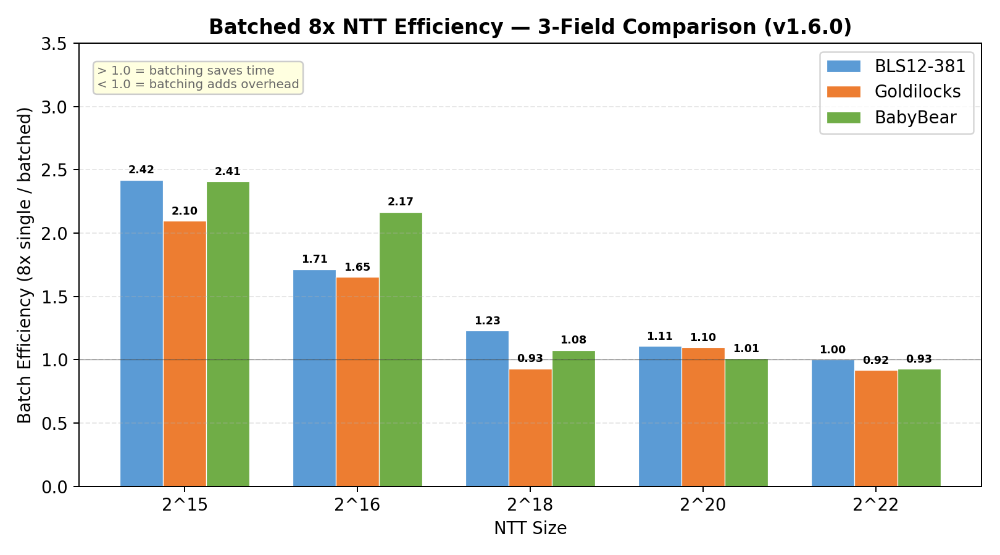
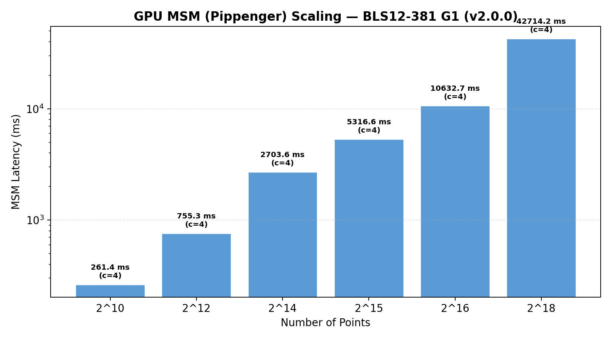
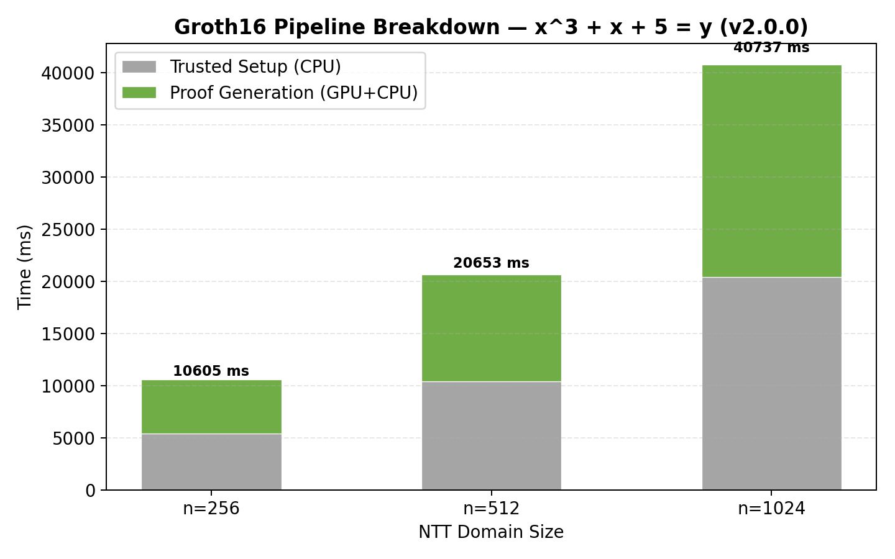

# cuda-zkp-ntt

**GPU-Accelerated Number-Theoretic Transform for Zero-Knowledge Proofs**

[](https://github.com/Artemarius/cuda-zkp-ntt/actions/workflows/build.yml)
[](https://developer.nvidia.com/cuda-toolkit)
[](https://en.cppreference.com/w/cpp/17)
[](LICENSE)

---

## Highlights

- **v2.1.0: Production MSM** — signed-digit recoding, CUB radix sort, parallel bucket reduction (Hillis-Steele), stream-ordered memory pools. **35.8x speedup** at n=2^18 (42.7s to 1.2s), 247 pts/ms at n=2^20.
- **v2.0.0: End-to-end Groth16 prover** — Fq/Fq2 field arithmetic, G1/G2 elliptic curve ops, MSM (Pippenger), polynomial operations, toy circuit x^3+x+5=y. GPU proof matches CPU proof bitwise.
- **v1.6.0: 3-field NTT** — BLS12-381 (15.1 ms), Goldilocks (3.6 ms, 4.2x faster), BabyBear (2.4 ms, 6.2x faster) at n=2^22
- **Multi-field comparison** demonstrates memory-bound convergence: speedup shrinks at large sizes as DRAM traffic dominates
- **15.5 ms at n=2^22** — 38% faster than v1.1.0 via radix-8 outer stages (Montgomery)
- **CUDA Graph API**: captures NTT kernel sequence for graph replay in larger workflows
- **Barrett + Montgomery dual arithmetic**: Barrett NTT eliminates 12% Montgomery conversion overhead
- **Batched NTT**: process 8 independent NTTs in 3-4 kernel launches (vs 32 sequential); **1.52x throughput** at 2^15
- **1.66x pipeline speedup** at 2^18 via 3-stream async double-buffered NTT
- **4 kernel launches** for n=2^22 (was 16): warp-shuffle fused radix-1024 + cooperative groups outer fusion
- **Memory-bound to compute-bound transformation**: fused kernel shifts bottleneck from 92% DRAM to 69% compute, IPC 1.56 to 2.41
- **57% SASS instruction reduction** in `ff_add` via branchless PTX with `lop3.b32` MUX
- **701 tests**, 8 Nsight Compute profiles, 10 annotated screenshots — full ZKProphet-style analysis on RTX 3060
- 3 fields: BLS12-381 (256-bit), Goldilocks (64-bit, Plonky2/3), BabyBear (31-bit, RISC Zero)
- **Negative results documented**: OTF twiddles (+265%), Plantard (+79%), 4-Step NTT (+18%)

---

## Motivation

Recent performance studies ([ZKProphet, IEEE IISWC 2025](https://arxiv.org/abs/2509.22684)) reveal a striking bottleneck in GPU-accelerated Zero-Knowledge Proof generation: while Multi-Scalar Multiplication (MSM) has been optimized to ~800× over CPU, the **Number-Theoretic Transform (NTT)** lags at only ~50× — and now accounts for up to **91% of end-to-end proof generation time**.

The root causes are well-documented but unaddressed in current open-source ZKP libraries:

- NTT kernels fail to overlap CPU→GPU data transfers with compute (unlike optimized MSM)
- Finite-field multiplication relies on expensive `IMAD` SASS instructions where cheaper `IADD3` sequences exist
- Launch configurations are hardcoded and frequently catastrophic (e.g., 16M blocks × 2 threads)

This project attacks both problems directly with two complementary CUDA implementations targeting the **BLS12-381 scalar field** used in production ZKP systems (Filecoin, Zcash, Ethereum rollups).

---

## What's Inside

### Direction A — Async-Pipelined NTT
A 3-stream double-buffered NTT pipeline using CUDA streams, `cudaMemcpyAsync`, and `cudaStreamWaitEvent` for cross-stream dependencies. Dedicated streams for H2D transfers, NTT compute, and D2H transfers enable maximum overlap across the GPU's copy and compute engines.

```
H2D Stream:    |--H2D(0)--|--H2D(1)--|--H2D(2)--|--H2D(3)--|
Compute[0/1]:       |--NTT(0)--|--NTT(1)--|--NTT(2)--|--NTT(3)--|
D2H Stream:              |--D2H(0)--|--D2H(1)--|--D2H(2)--|--D2H(3)--|
```

### Direction B — Optimized Finite-Field Arithmetic
A from-scratch Montgomery multiplication kernel for the BLS12-381 scalar field (255-bit prime), targeting the `IADD3` instruction path. ZKProphet §IV-C shows that 70.8% of FF_mul instruction mix is `IMAD` (4-cycle issue latency) vs `IADD3` (2-cycle). Converting the critical path reduces stall cycles and increases integer pipeline utilization.

Key implementation choices:
- 8-limb 32-bit Montgomery representation for the 255-bit BLS12-381 scalar modulus
- Fused multiply-add using PTX `mad.lo.cc` / `mad.hi.cc` intrinsics
- Conditional reduction branchless via predicated instructions
- Roofline-validated against NVIDIA A-series integer throughput ceiling

---

## Performance Results

> Profiling conducted on NVIDIA RTX 3060 Laptop GPU (Ampere, 30 SMs, CUDA 12.8).
> Reference baseline: bellperson NTT (radix-256 Cooley-Tukey).

**NTT Compute (device-to-device, no transfer):**

| Implementation | Scale 2¹⁸ | Scale 2²⁰ | Scale 2²² | vs. Naive |
|---|---|---|---|---|
| Naive GPU NTT (radix-2) | 1.36 ms | 5.93 ms | 26.3 ms | 1.0x |
| v1.1 Montgomery (fused K=10 + coop outer) | 1.21 ms | 5.51 ms | 25.1 ms | 1.04x |
| v1.2 Barrett (no Montgomery conversion) | 1.27 ms | 5.61 ms | 24.9 ms | 1.05x |
| v1.3 4-Step (Bailey's algorithm) | 1.66 ms | 7.03 ms | 29.5 ms | 0.89x |
| v1.4 Montgomery (branchless + radix-4) | 0.952 ms | 4.11 ms | 17.1 ms | 1.54x |
| v1.4 Barrett (branchless + radix-4) | 1.02 ms | 4.39 ms | 17.4 ms | 1.51x |
| **v1.5 Montgomery** (radix-8 outer) | 1.75 ms | 5.53 ms | **15.5 ms** | **1.70x** |
| **v1.5 Barrett** (radix-4, unchanged) | 1.93 ms | 5.86 ms | **17.5 ms** | **1.50x** |

**Multi-Field NTT Comparison (v1.6.0, single NTT, 7-rep median):**

| Field | Element Size | Scale 2¹⁵ | Scale 2¹⁸ | Scale 2²⁰ | Scale 2²² | Speedup vs BLS |
|---|---|---|---|---|---|---|
| **BLS12-381** | 256-bit (32 B) | 0.288 ms | 1.05 ms | 3.95 ms | **15.1 ms** | 1.0x |
| **Goldilocks** | 64-bit (8 B) | 0.033 ms | 0.139 ms | 0.762 ms | **3.6 ms** | **4.2x** |
| **BabyBear** | 31-bit (4 B) | 0.025 ms | 0.093 ms | 0.398 ms | **2.4 ms** | **6.2x** |

*Speedup decreases at larger sizes because outer stages are memory-bound (DRAM bandwidth), not arithmetic-bound. At n=2^10, BabyBear is 19.7x faster (arithmetic-dominated). At n=2^22, only 6.2x (DRAM-dominated).*

<p align="center">
  
  
</p>

**Async Pipeline (end-to-end including H2D + compute + D2H, 8 batches, pinned memory):**

| | Scale 2¹⁸ | Scale 2²⁰ | Scale 2²² |
|---|---|---|---|
| Pipelined (3-stream) | 29.7 ms | 141 ms | 541 ms |
| Sequential (1-stream) | 49.4 ms | 188 ms | 579 ms |
| **Speedup** | **1.66x** | **1.33x** | **1.07x** |

*RTX 3060 Laptop GPU, Release build, 7-rep median.*
*Pipeline speedup limited at 2²² by DMA interference (memory controller contention).*

**Batched NTT Throughput (8 NTTs, compute only):**

| | Scale 2¹⁵ | Scale 2¹⁸ | Scale 2²⁰ | Scale 2²² |
|---|---|---|---|---|
| **v1.5 Montgomery batch 8x** | **1.54 ms** | **7.25 ms** | **31.2 ms** | **130 ms** |
| **v1.5 Barrett batch 8x** | **1.81 ms** | **7.48 ms** | **33.1 ms** | **148 ms** |
| v1.4 Montgomery batch 8x | 0.874 ms | 7.51 ms | 33.4 ms | 150 ms |
| v1.4 Barrett batch 8x | 0.935 ms | 8.02 ms | 35.5 ms | 159 ms |
| v1.5 vs v1.4 (Mont) | — | **-3%** | **-7%** | **-13%** |

*Radix-8 outer stages (Montgomery) reduce batch time by 7-13% at large sizes. Montgomery remains faster than Barrett for all workloads.*

**On-the-Fly Twiddle Computation — Negative Result (v1.5.0):**

OTF twiddle computation (replacing 64 MB precomputed table with ~1 KB constant memory) was fully
implemented (12 kernel variants, 16 tests) but is **catastrophically slower** for BLS12-381:
56.9 ms OTF vs 15.6 ms precomputed (+265%). Root cause: 256-bit binary exponentiation requires
~29 Montgomery muls per butterfly (~4480 MADs) vs 7 DRAM reads (224 bytes). Infrastructure retained
for future multi-field work (Goldilocks/BabyBear where mul is 1-2 instructions).
See [analysis](results/analysis.md#103-on-the-fly-twiddle-computation--negative-result-session-14).

**4-Step NTT — Negative Result (v1.3.0):**

The 4-step NTT (Bailey's algorithm) was fully implemented and tested (221 tests) but is **slower
than the cooperative approach** at all sizes. At n=2^22: 29.5 ms (4-step) vs 24.9 ms (Barrett) =
+18%. Root cause: 3 transpose passes add DRAM overhead; sub-NTTs of 2048 elements still have 1
cooperative outer stage hitting DRAM. See [analysis](results/analysis.md#section-6--v130-results-4-step-ntt-algorithm).

<p align="center">
  
  
</p>

<p align="center">
  
  
</p>

**Nsight Compute Kernel Profile (2^20 elements):**

| Metric | FF_mul (isolated) | NTT Naive Butterfly | NTT Fused (radix-256) |
|---|---|---|---|
| Bottleneck | **Memory (92% DRAM)** | **Memory (79%)** | **Compute (69%)** |
| Compute Throughput | 64% | 45% | **69%** |
| ALU Pipe Utilization | 44.5% | 41.5% | **67.3%** |
| Executed IPC | 1.87 | 1.56 | **2.41** |
| Top Warp Stall | Long Scoreboard (mem) | LG Throttle (mem) | **Math Pipe Throttle** |
| DRAM Throughput | 305 GB/s | 260 GB/s | ~50 GB/s (shared mem) |

The fused radix-256 kernel transforms the workload from memory-bound to **compute-bound** — data lives in shared memory across 8 butterfly stages, eliminating global memory round-trips and saturating the integer ALU pipe.

**Direction B — SASS Instruction Reduction (cuobjdump, sm_86 Release):**

| FF Operation | Baseline SASS | Branchless v2 | Reduction | Technique |
|---|---|---|---|---|
| `ff_add` | 127 | 55 | **-57%** | PTX carry chain + LOP3 MUX, enables 128-bit vectorized loads |
| `ff_sub` | 94 | 55 | **-41%** | `sub.cc` chain + `lop3.b32` replaces ISETP+SEL comparison |
| `ff_mul` | 571 | 527 | **-8%** | Branchless conditional reduction (CIOS loop unchanged) |
| `ff_sqr` | 563 | 511 | **-9%** | Same as ff_mul (sqr = mul(a, a)) |

*Throughput unchanged in isolated microbenchmarks (memory-bound at 92% DRAM). Instruction-level gains realized inside the compute-bound fused NTT kernel.*

<p align="center">
  
  
</p>

See [`results/analysis.md`](results/analysis.md) for the full annotated NTT analysis with Nsight Compute screenshots.

---

## v2.1.0 — Production MSM

Signed-digit window recoding halves bucket count, CUB radix sort replaces single-thread sort,
segment-offset parallel accumulation replaces binary search, Hillis-Steele suffix scan replaces
single-thread running sum. Window auto-tuner caps `c` at 11 for parallel reduction.
Stream-ordered memory pools (cudaMallocAsync) cache allocations across calls.

**MSM benchmark (RTX 3060, 7-rep median):**

| Size | v2.0.0 | v2.1.0 | Speedup | Throughput |
|------|--------|--------|---------|------------|
| 2^10 | 261 ms | 123 ms | 2.1x | 8 pts/ms |
| 2^14 | 2,697 ms | 565 ms | 4.8x | 29 pts/ms |
| 2^18 | 42,603 ms | **1,194 ms** | **35.8x** | 220 pts/ms |
| 2^20 | — | 4,249 ms | — | 247 pts/ms |

---

## v2.0.0 — Groth16 GPU Primitives

End-to-end GPU-accelerated Groth16 prover for BLS12-381, connecting NTT, coset NTT, MSM (Pippenger), and elliptic curve arithmetic.

**New primitives:**
- **Fq** (381-bit base field, 12×u32 CIOS Montgomery): add/sub/mul/sqr/inv/neg
- **Fq2** (quadratic extension, Karatsuba): 3 Fq muls per Fq2 mul
- **G1/G2** (Jacobian projective): point add, double, scalar_mul, affine conversion, on-curve checks
- **MSM** (Pippenger): signed-digit recoding → CUB radix sort → parallel accumulation → parallel reduction → Horner
- **Polynomial ops**: coset NTT, pointwise mul/sub, scale kernels
- **Groth16 pipeline**: R1CS×witness → INTT → coset NTT → pointwise → coset INTT → EC assembly

**Toy circuit: x³ + x + 5 = y** (4 R1CS constraints, 6 variables, domain_size=256).
GPU proof matches CPU proof bitwise (cross-validated).

<p align="center">
  
  
</p>

See [`results/analysis_v200.md`](results/analysis_v200.md) for the v2.0.0 performance analysis.

---

## Repository Structure

```
cuda-zkp-ntt/
├── include/
│   ├── cuda_utils.cuh         # CUDA_CHECK macro, GPU timer
│   ├── ff_arithmetic.cuh      # BLS12-381 Fr Montgomery mul (256-bit, 8×u32)
│   ├── ff_barrett.cuh         # Barrett modular arithmetic (standard-form)
│   ├── ff_plantard.cuh        # Plantard modular arithmetic (negative result)
│   ├── ff_goldilocks.cuh      # Goldilocks field (64-bit, Plonky2/3)
│   ├── ff_babybear.cuh        # BabyBear field (31-bit, RISC Zero)
│   ├── ff_fq.cuh              # BLS12-381 Fq base field (381-bit, 12×u32 Montgomery)
│   ├── ff_fq2.cuh             # Fq2 quadratic extension (Karatsuba, 3 Fq muls)
│   ├── ec_g1.cuh              # G1 elliptic curve ops (Jacobian projective)
│   ├── ec_g2.cuh              # G2 elliptic curve ops (over Fq2)
│   ├── msm.cuh                # GPU MSM (Pippenger, signed-digit, parallel reduce)
│   ├── poly_ops.cuh           # Polynomial ops (coset NTT, pointwise mul/sub)
│   ├── groth16.cuh            # Groth16 prover API (R1CS, ProvingKey, Proof)
│   ├── ntt.cuh                # BLS12-381 NTT (single + batched + graph, 5 modes)
│   ├── ntt_goldilocks.cuh     # Goldilocks NTT (forward/inverse, single/batched)
│   ├── ntt_babybear.cuh       # BabyBear NTT (forward/inverse, single/batched)
│   ├── pipeline.cuh           # Async pipeline infrastructure
│   └── twiddle_otf.cuh        # On-the-fly twiddle computation (disabled for BLS12-381)
├── src/
│   ├── ff_mul.cu              # BLS12-381 Montgomery/Barrett/Plantard kernels
│   ├── ff_multi_field.cu      # Goldilocks + BabyBear GPU throughput kernels
│   ├── ff_fq_kernels.cu       # Fq/Fq2 GPU throughput kernels
│   ├── ec_kernels.cu          # G1/G2 GPU test kernels
│   ├── msm.cu                 # Pippenger MSM (separate TU, no RDC)
│   ├── poly_ops.cu            # Coset NTT, pointwise mul/sub/scale kernels
│   ├── groth16.cu             # Groth16 prover: trusted setup + proof generation
│   ├── ntt_naive.cu           # Baseline radix-2 NTT + API dispatch + twiddle caches
│   ├── ntt_optimized.cu       # BLS12-381 NTT: K selection + cooperative outer fusion
│   ├── ntt_fused_kernels.cu   # Fused warp-shuffle + shmem kernel (K=8/9/10, no-RDC)
│   ├── ntt_4step.cu           # 4-Step NTT: transpose, twiddle multiply, Bailey's algorithm
│   ├── ntt_goldilocks.cu      # Goldilocks NTT: fused K=8-11 + cooperative outer
│   ├── ntt_babybear.cu        # BabyBear NTT: fused K=8-11 + cooperative outer
│   ├── ntt_async.cu           # Double-buffered async pipeline
│   └── benchmark.cu           # Profiling binary (Nsight Compute target)
├── tests/
│   ├── test_correctness.cu    # Validation against CPU reference (701 tests)
│   └── ff_reference.h         # CPU-only finite field + NTT + EC reference oracle
├── benchmarks/
│   ├── bench_ntt.cu           # Google Benchmark: BLS12-381 NTT latency vs scale
│   ├── bench_multifield.cu    # 3-way benchmark: BLS vs Goldilocks vs BabyBear
│   ├── bench_msm.cu           # MSM (Pippenger) benchmark at various sizes
│   ├── bench_groth16.cu       # Groth16 pipeline benchmark with phase breakdown
│   └── ff_microbench.cu       # Isolated FF_add / FF_mul throughput
├── profiling/
│   ├── scripts/               # Nsight Compute / Systems automation scripts
│   └── README.md              # Profiling methodology
├── results/
│   ├── screenshots/           # Nsight Compute roofline + warp analysis
│   ├── charts/                # Generated benchmark comparison charts (23 PNGs)
│   ├── data/                  # Raw benchmark JSON/CSV output
│   ├── analysis.md            # Annotated NTT performance analysis (v1.x)
│   └── analysis_v200.md       # v2.0.0 MSM + Groth16 performance analysis
├── scripts/
│   ├── plot_benchmarks.py     # Generate v1.x benchmark charts
│   └── plot_groth16.py        # Generate v2.0.0 charts (MSM, Groth16)
├── .github/
│   └── workflows/
│       └── build.yml          # CI: Linux (CUDA 12.8/12.6) + Windows (MSVC)
├── CMakeLists.txt
├── CLAUDE.md                  # Dev environment, conventions, file map
├── GUIDE.md                   # Deep-dive: ZKP, NTT, finite fields, GPU optimization
├── NTT_OPTIMIZATION_ROADMAP.md # Full optimization roadmap (v1.0-v2.2)
├── LICENSE                    # MIT License
└── README.md
```

---

## Building

### Prerequisites
- CUDA Toolkit 12.x
- CMake 3.20+
- C++17-capable compiler (GCC 11+ / MSVC 2022 / Clang 14+)
- Python 3.8+ (for profiling scripts, optional)

```bash
git clone https://github.com/Artemarius/cuda-zkp-ntt
cd cuda-zkp-ntt
```

### Linux / WSL2
```bash
cmake -B build -DCMAKE_BUILD_TYPE=Release
cmake --build build -j$(nproc)
```

### Windows (MSVC 2022)
```bash
cmake -B build -DCMAKE_CUDA_ARCHITECTURES=86
cmake --build build --config Release
```

### Running Tests
```bash
# Linux / WSL2
./build/test_correctness

# Windows (MSVC multi-config)
./build/Release/test_correctness.exe
```

### Running Benchmarks
```bash
# Linux / WSL2
./build/ff_microbench --benchmark_format=csv
./build/bench_ntt --benchmark_format=csv > results/data/bench_output.csv

# Windows (MSVC multi-config)
./build/Release/ff_microbench.exe --benchmark_format=csv
./build/Release/bench_ntt.exe --benchmark_format=csv > results/data/bench_output.csv
```

---

## Profiling

See [`profiling/README.md`](profiling/README.md) for the full Nsight Compute methodology, including roofline analysis, warp stall breakdown, and instruction-level metrics replicating the ZKProphet analysis framework on RTX 3060.

```bash
# Full Nsight Compute profile
bash profiling/scripts/profile_ntt.sh

# Lightweight metric collection
bash profiling/scripts/collect_metrics.sh
```

---

## Technical Background

See [`GUIDE.md`](GUIDE.md) for comprehensive coverage of:
- Zero-Knowledge Proof system architecture (Groth16)
- Number-Theoretic Transform: math, Cooley-Tukey algorithm, GPU parallelization
- Finite fields: Montgomery arithmetic, modular reduction, BLS12-381
- GPU microarchitecture: IMAD vs IADD3, warp stalls, occupancy, roofline model
- CUDA async compute: streams, double buffering, `cudaMemcpyAsync`

---

## Context & Related Work

This project is directly motivated by three papers:

- **ZKProphet** (Verma et al., IEEE IISWC 2025) — systematic GPU performance characterization of ZKP proof generation, identifying NTT as the dominant bottleneck post-MSM optimization
- **cuZK** (Lu et al., TCHES 2023) — efficient GPU implementation of zkSNARK with novel parallel MSM via sparse matrix operations and async data transfer
- **MoMA** (Zhang & Franchetti, [ACM CGO 2025](https://arxiv.org/abs/2501.07535)) — Multi-word Modular Arithmetic code generation achieving 13× over ICICLE for 256-bit NTTs and near-ASIC performance on commodity GPUs via Barrett reduction and batched NTT processing

The optimization targets (async NTT pipeline, IADD3-path FF_mul) are explicitly called out as open problems in ZKProphet §V-B. v1.2.0 adopts MoMA-inspired Barrett arithmetic and batched NTT processing. v1.3.0 implements the 4-step NTT (Bailey's algorithm) — a negative result that demonstrates transpose overhead exceeds outer-stage savings on consumer GPUs. v1.4.0 achieves a 32% speedup via branchless arithmetic and radix-4 outer stages, plus a CUDA Graph API. v1.5.0 pushes to 38% faster via radix-8 outer stages (Montgomery only; Barrett radix-8 disabled due to I-cache thrashing at 174 registers). v1.6.0 adds Goldilocks (Plonky2/3) and BabyBear (RISC Zero) NTT implementations, demonstrating that smaller fields achieve 4-6x speedup at proof-relevant sizes — confirming that the ZKP ecosystem's move to smaller fields yields concrete GPU performance benefits. v1.7.0 implements Plantard reduction — another negative result (+79% vs Montgomery for 256-bit fields; viable only for word-size moduli). v2.0.0 adds all remaining Groth16 primitives (Fq/Fq2, G1/G2, MSM, polynomial ops) and an end-to-end toy prover with GPU proof matching CPU bitwise. v2.1.0 delivers production MSM with signed-digit recoding, CUB radix sort, parallel bucket reduction (Hillis-Steele suffix scan), and stream-ordered memory pools — achieving 35.8x speedup at n=2^18. See [NTT_OPTIMIZATION_ROADMAP.md](NTT_OPTIMIZATION_ROADMAP.md) for the full optimization roadmap.

---

## License

MIT
